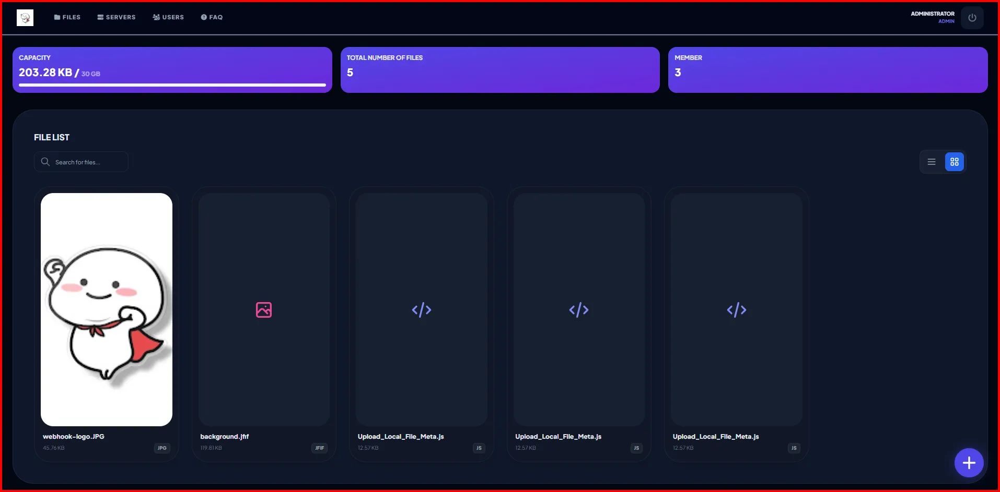
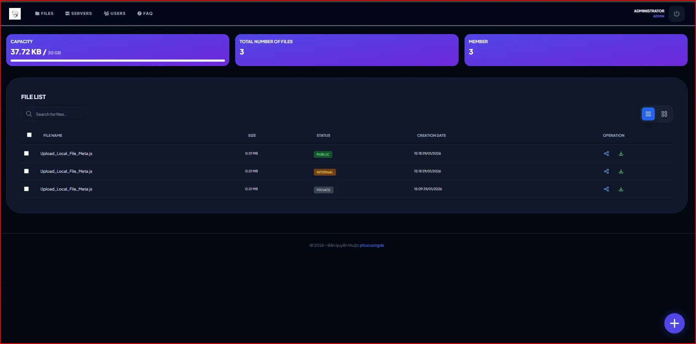
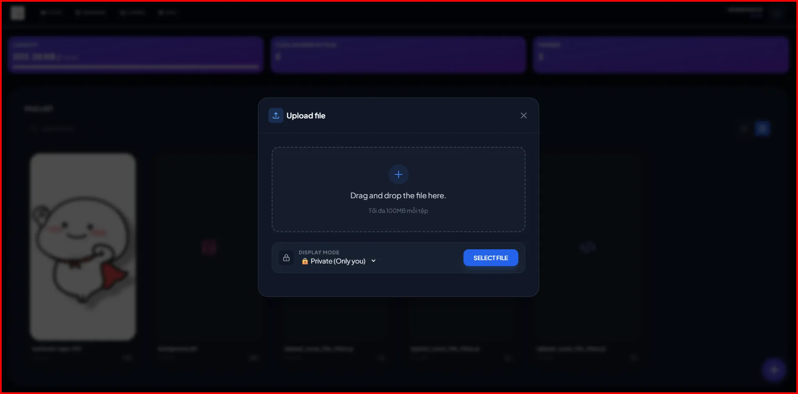
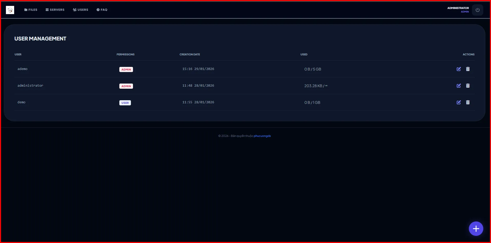
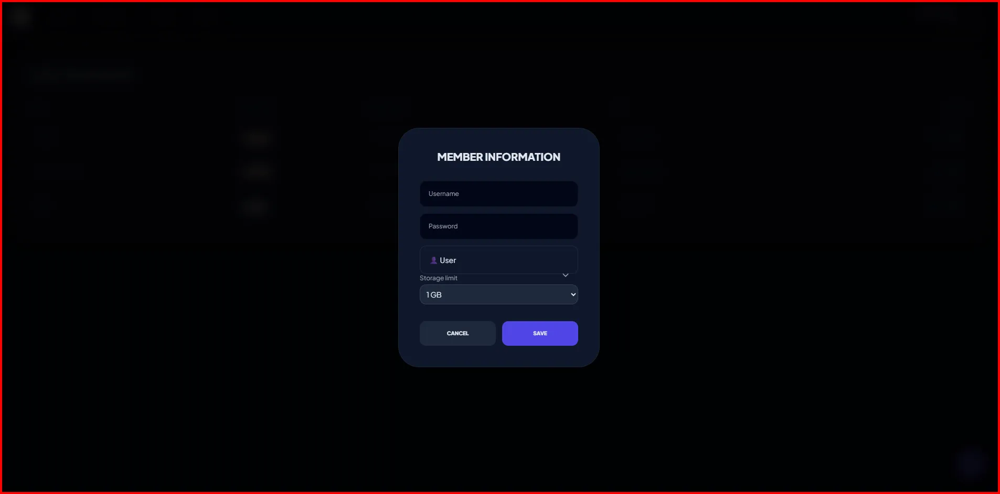
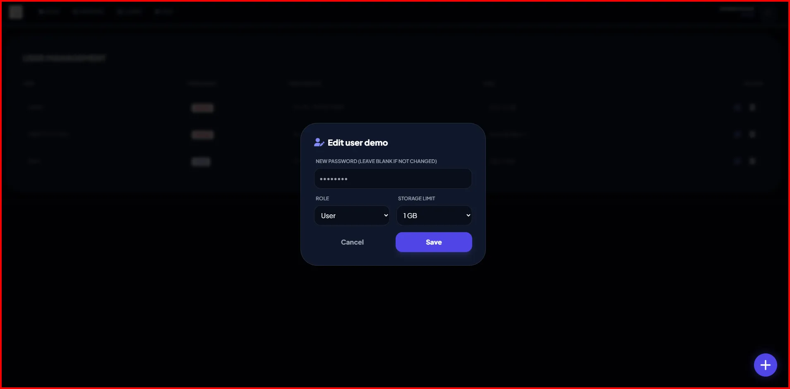
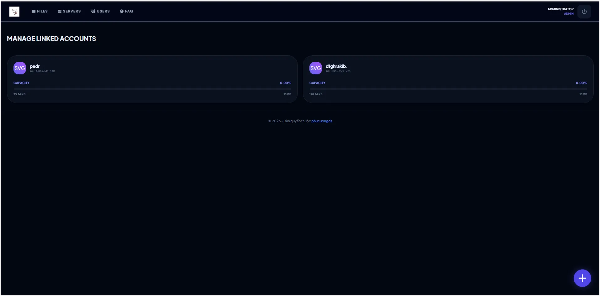
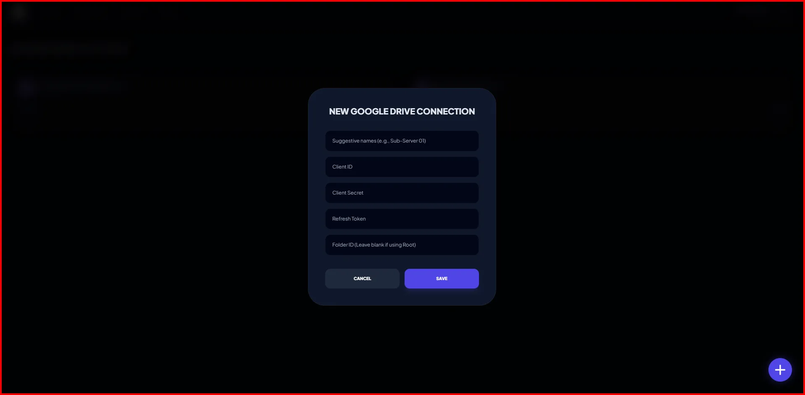

# CloudDrive Manager 🚀

A high-performance, modern, and secure **File Management System** built with **Cloudflare Workers**, **D1 Database**, and **Google Drive API**. This system allows users to leverage Google Drive as a powerful backend storage while providing a custom, elegant, and controlled interface.

### ScreenShort

















### **Demo Online** [DEMO](https://gdrive.tsc-hpc.workers.dev/)

**Admin account:**
 ```bash
ademo
ademo@1234
 ```
**Demo account:**
 ```bash
demo
demo@1234
 ```

## ✨ Key Features

* **Multi-Account Support**: Manage multiple Google Drive accounts/servers from a single dashboard.
* **Edge Computing**: Powered by Cloudflare Workers for ultra-low latency and global availability.
* **Serverless Database**: Utilizes Cloudflare D1 for blazing-fast metadata management.
* **Admin Dashboard**: Comprehensive tools for managing users, storage quotas, and server health.
* **Direct & Proxy Streaming**: Supports raw file links and proxied streaming for media players.
* **Intelligent Caching**: Built-in thumbnail and metadata caching to optimize API usage.
* **Robust Security**: 
    * Role-based access control (Admin/User).
    * Session-based integrity checks.
    * Secure token rotation (OAuth2).

## 🛠️ Tech Stack

* **Runtime:** [Cloudflare Workers](https://workers.cloudflare.com/)
* **Database:** [Cloudflare D1](https://developers.cloudflare.com/d1/)
* **Storage Backend:** Google Drive API v3
* **Frontend:** Tailwind CSS, Vanilla JS (Optimized & Minified)
* **Security:** Web Crypto API (SHA-256), OAuth2


## 🚀 Installation & Setup

...

## 🛡️ Integrity & Licensing

This project includes a built-in DOM integrity check to protect copyright and ownership information. Any unauthorized removal of the footer or modification of the attribution links will trigger an automatic security redirect to the author's official site.

## 🤝 Contribution

Contributions, issues, and feature requests are welcome! Feel free to check the [issues page](https://github.com/WIKIANOW/gdrive/issues).

---

**Developed with ❤️ by [phucuongds](https://phucuongds.vercel.app)**
